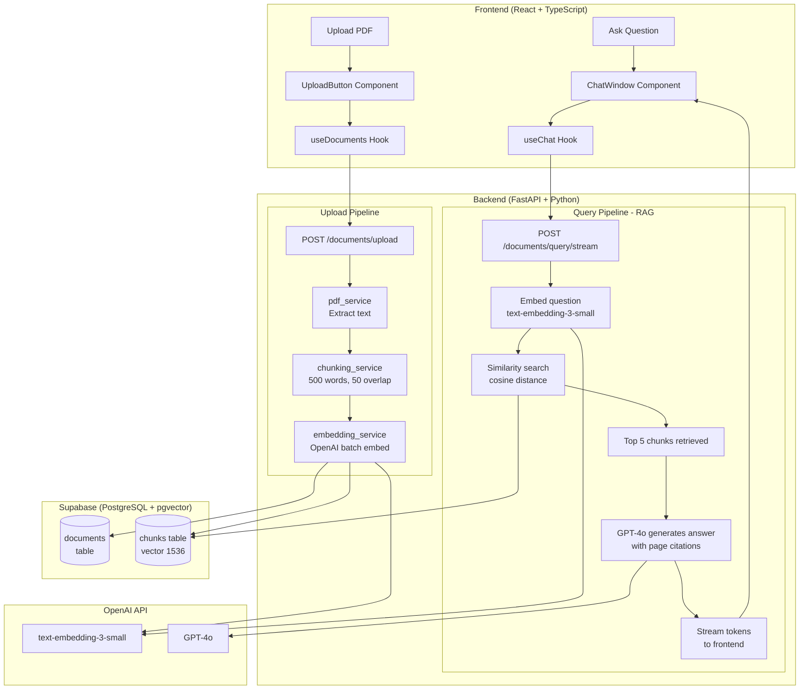

# Document Q&A

An AI powered document Q&A app. Upload PDFs and ask questions about them. Built with RAG (Retrieval Augmented Generation).

## ✨ Features

- Upload PDF documents and ask questions about them
- Answers are grounded in your documents no hallucinations
- Real-time streaming responses token by token
- Source citations with page numbers
- Multi-document support query across all uploaded PDFs
- Rate limiting to prevent API abuse

## ⚙️ Setup

### Prerequisites
- Python 3.11+
- Node.js 18+
- A Supabase account
- An OpenAI API key

### 1. Clone the repo
```bash
git clone https://github.com/Div-B/Document-Q-A/.git
cd doc-qa-app
```

### 2. Backend setup
```bash
cd backend
uv install
cp .env.example .env
# Fill in your credentials in .env
uv run uvicorn app.main:app --reload
```

### 3. Frontend setup

```bash
cd frontend
npm install
npm run dev
```

### 4. Supabase setup
Run the SQL in `backend/supabase/schema.sql` in your Supabase SQL editor.

### 5. Open the app
- Frontend: http://localhost:5173
- API docs: http://localhost:8000/docs

## 📝 Environment Variables
```bash
OPENAI_API_KEY=       # OpenAI API key
SUPABASE_URL=         # Supabase project URL
SUPABASE_KEY=         # Supabase publishable key
MAX_FILE_SIZE_MB=10   # Maximum PDF upload size(default 10MB)
```
## Architecture


## How RAG Works

Traditional LLMs can't answer questions about your private documents. RAG solves this:

1. **Parse** - extract text from your PDF page by page
2. **Chunk** — split text into 500 word overlapping chunks
3. **Embed** — convert each chunk into a 1536 dimension vector using OpenAI
4. **Store** — save vectors in Supabase with pgvector
5. **Query** — embed the question, find the most similar chunks, send them to GPT-4o
6. **Answer** — GPT-4o generates a grounded answer citing page numbers

## 🛠️ Tech Stack

| Layer | Technology |
|---|---|
| Frontend | React + TypeScript |
| Styling | Tailwind CSS |
| Backend | FastAPI (Python) |
| LLM | GPT-4o |
| Embeddings | text-embedding-3-small |
| Database | Supabase (PostgreSQL) |
| Vector Search | pgvector |
| PDF Parsing | PyMuPDF |

## 🧪 Testing
```bash
# Backend tests
cd backend
uv run pytest tests/ -v

# Frontend tests
cd frontend
npm run test:run
```
